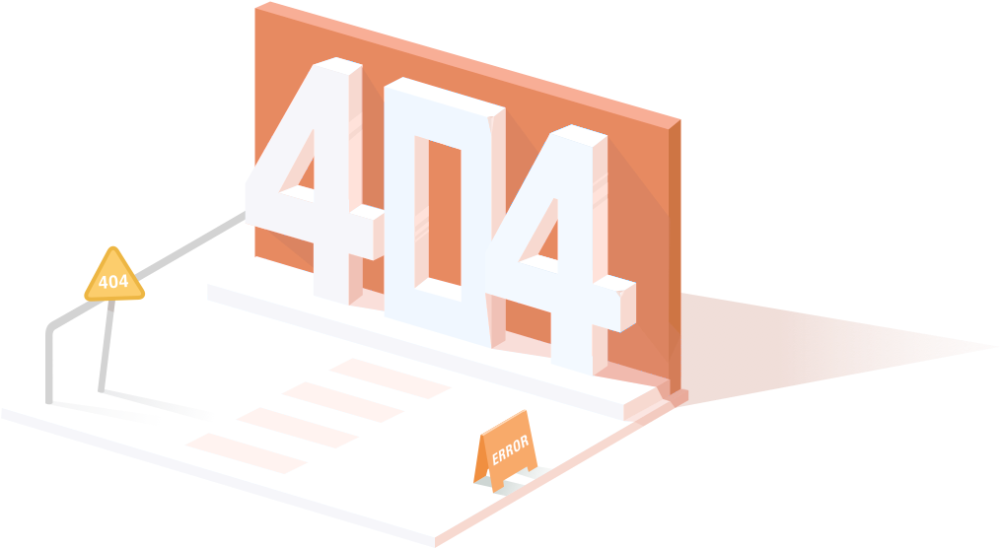

<head>
    <!-- import CSS -->
    <link rel="stylesheet" href="https://unpkg.com/element-ui/lib/theme-chalk/index.css">
</head>

  

    

      <!-- 

        
        
      
 -->
      
    

    

      <h1>OOPS!</h1>
      <h4>Essa página não existe... <el-button><a href="index.html">Voltar para Home</a></el-button></h4>
    

  

<body>
  <!-- import vue -->
  
  <!-- import element ui -->
  
</body>

